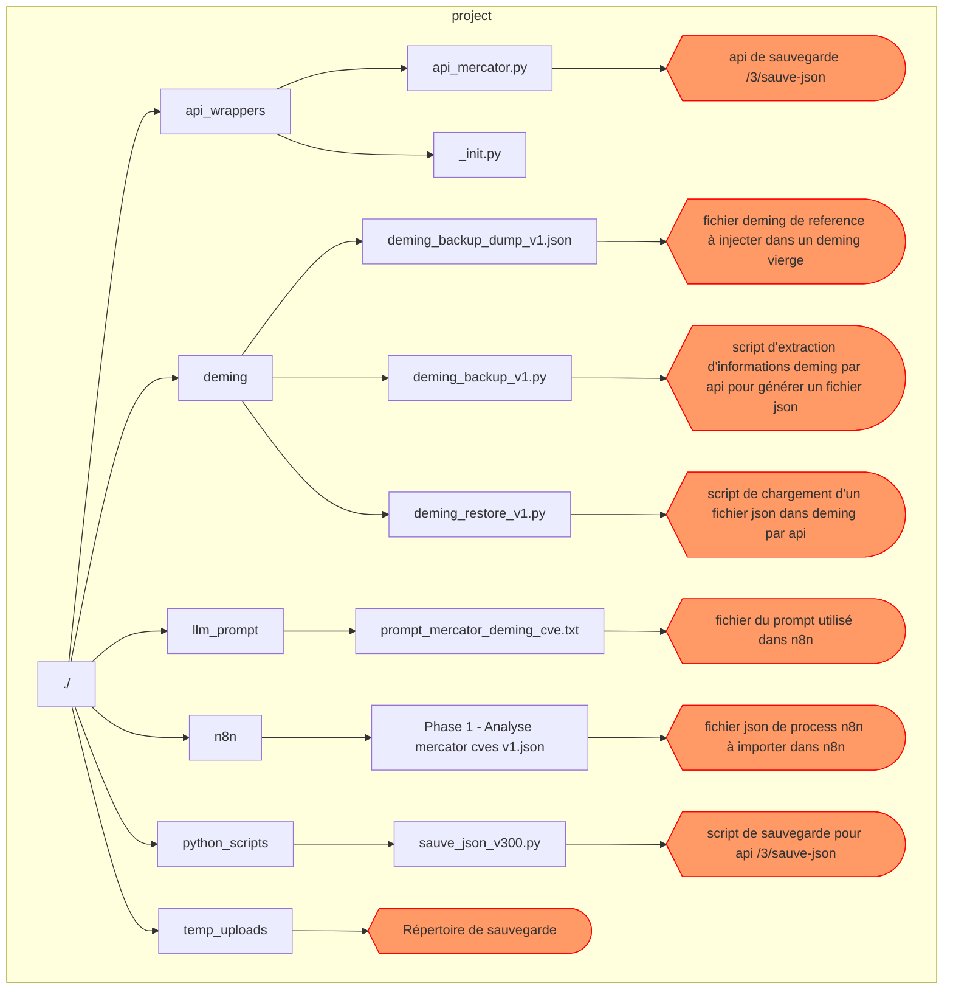
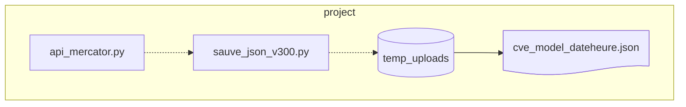

## Liste des fichiers du répertoire

`Note: Tous les fichiers .py sont des fichiers de scripts python ou python uvicorn`

```mermaid
flowchart TB

    subgraph project
        ./ --> api_wrappers
        ./ --> deming
        ./ --> llm_prompt
        ./ --> n8n
        ./ --> python_scripts
        ./ --> temp_uploads

        api_wrappers --> AA["api_mercator.py"] --> A@{ shape: curv-trap, label: "api de sauvegarde /3/sauve-json"}
        api_wrappers --> _init.py

        deming --> deming_backup_dump_v1.json --> D@{ shape: curv-trap, label: "fichier deming de reference à injecter dans un deming vierge"}
        deming --> deming_backup_v1.py --> E@{ shape: curv-trap, label: "script d'extraction d'informations deming par api pour générer un fichier json"}
        deming --> deming_restore_v1.py --> G@{ shape: curv-trap, label: "script de chargement d'un fichier json dans deming par api"}
        
        llm_prompt --> RR["prompt_mercator_deming_cve.txt"]  --> I@{ shape: curv-trap, label: "fichier du prompt utilisé dans n8n"}

        n8n --> PP["Phase 1 - Analyse mercator cves v1.json"] --> H@{ shape: curv-trap, label: "fichier json de process n8n à importer dans n8n"}

        
        python_scripts --> S["sauve_json_v300.py"] --> B@{ shape: curv-trap, label: "script de sauvegarde pour api /3/sauve-json"}
       
        temp_uploads --> C@{ shape: curv-trap, label: "Répertoire de sauvegarde"}

        A:::explain
        B:::explain
        C:::explain
        D:::explain
        E:::explain
        G:::explain
        H:::explain
        I:::explain
        

    classDef explain stroke:#f00, fill:#f96

    end
```

### Sauvegarde du résultat json

```mermaid
flowchart TB
    subgraph project

        AA["api_mercator.py"]
        S["sauve_json_v300.py"]

        AA -.-> S
        S -.-> A@{ shape: cyl, label: "temp_uploads" } --> F@{shape: doc, label : "cve_model_dateheure.json"}

    end

```