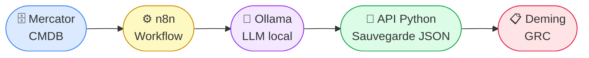
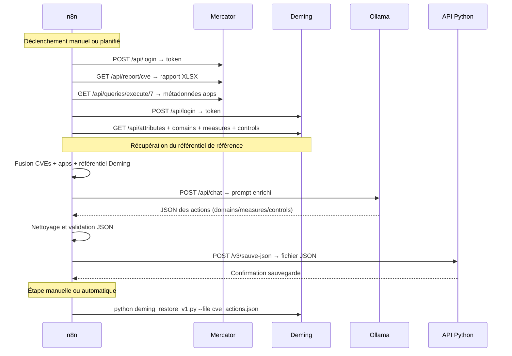
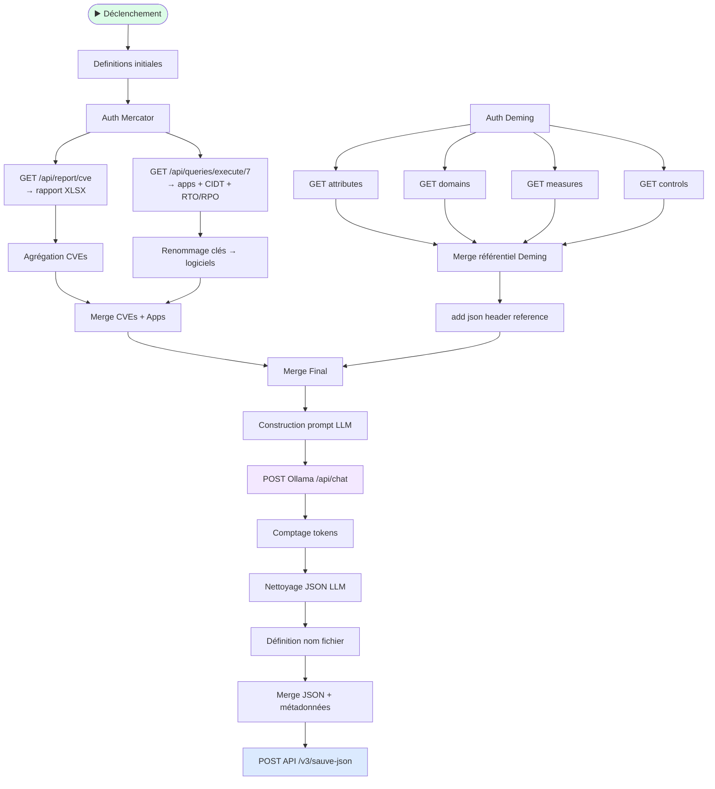
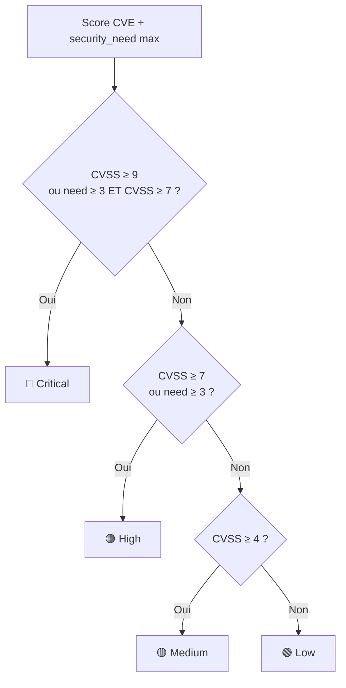
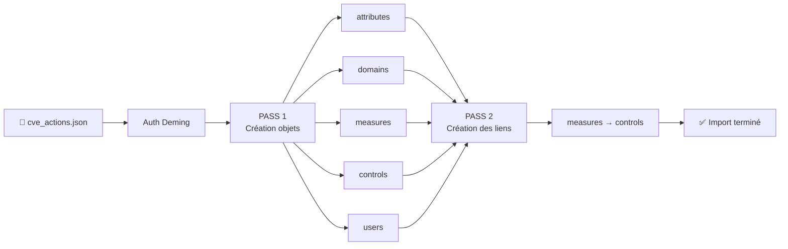
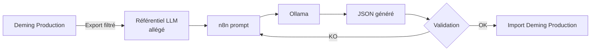
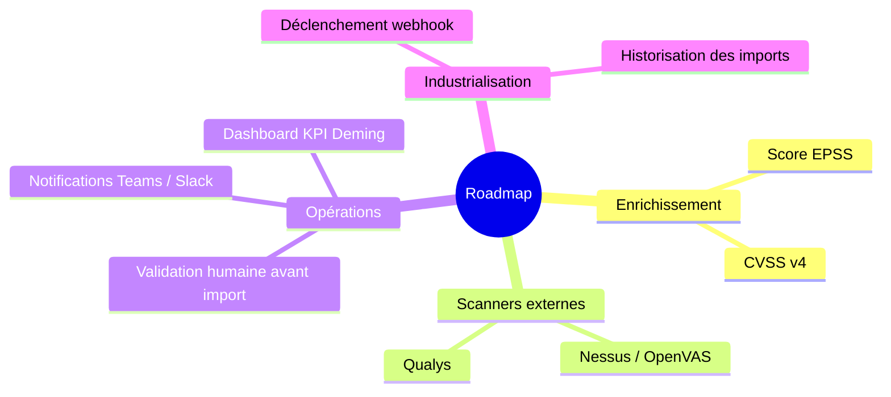
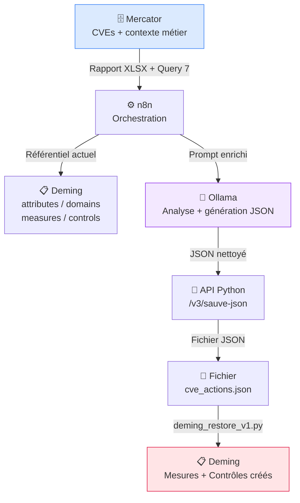

# Mercator → Deming : Automatisation de la gestion des CVEs

> Transformer une CMDB technique en moteur opérationnel de pilotage cyber — de la détection à l'action.


## ATTENTION: tous ces fichiers et le process sont fourni à titre d'exemple de faisabilité, et doivent être adaptés à votre environnement et testés. Je ne peux pas garantirni prendere d'engagement sur l'intégrité et le risque de perte de vos données"

---

## Vue d'ensemble

Ce projet automatise le cycle complet de gestion des vulnérabilités : depuis leur détection dans **Mercator** (CMDB), jusqu'à la création de plans d'actions dans **Deming** (GRC), en passant par une analyse contextuelle par LLM local (**Ollama**) orchestrée par **n8n**.



**Ce que ça apporte :**
- Priorisation automatique des CVEs par criticité métier (CIDT : Confidentialité, Intégrité, Disponibilité, Traçabilité)
- Plans d'actions prêts à l'emploi dans Deming, sans saisie manuelle
- Traçabilité complète : CVE → application → serveur → action corrective

---

## Prérequis

| Composant | Rôle | Version |
|-----------|------|---------|
| [Mercator](https://github.com/dbarzin/mercator) | CMDB source des CVEs | latest |
| [Deming](https://github.com/dbarzin/deming) | GRC cible des actions | latest |
| [n8n](https://n8n.io) | Orchestration du workflow | latest |
| [Ollama](https://ollama.ai) | LLM local (pas de cloud) | latest |
| Python | API de sauvegarde JSON | 3.11+ |

```bash
# Dépendances Python
pip install fastapi uvicorn requests

# Modèle LLM recommandé
ollama pull qwen3.5:397b-cloud
# ou
ollama pull gemma4:31b-cloud
```

---

## Architecture détaillée

### Flux de données



---

## Détail du workflow n8n

### Variables de configuration (nœud `Definitions initiales`)

| Variable | Exemple | Description |
|----------|---------|-------------|
| `company` | `mon-entreprise` | Nom utilisé dans les noms de fichiers |
| `directory` | `/home/user/mercator` | Répertoire de travail |
| `mercatorHost:Port` | `localhost:8081` | Adresse Mercator |
| `demingHost:Port` | `localhost:8030` | Adresse Deming |
| `ollamaHost` | `localhost` | Adresse Ollama |
| `ollamaModel` | `qwen3.5:32b` | Modèle LLM à utiliser |
| `apiHost:Port` | `localhost:8020` | Adresse de l'API Python |

### Étapes du workflow



---

## Données extraites de Mercator

### Source 1 : Rapport CVE (`GET /api/report/cve`)

Retourne un fichier XLSX avec pour chaque application :

| Champ | Description |
|-------|-------------|
| `Nom` | Nom de l'application |
| CPE | Identifiant du composant vulnérable |
| CVE ID | Identifiant de la vulnérabilité |
| Score CVSS | Sévérité (0–10) |
| Description | Détail de la vulnérabilité |

> 📖 Documentation Mercator : https://dbarzin.github.io/mercator/fr/vulnerabilities/

### Source 2 : Métadonnées applicatives (`GET /api/queries/execute/7`)

```sql
FROM applications
FIELDS name, description, product, vendor, version, users, attributes, processes.name, processes.description, processes.owner, processes.activities.name, processes.macro_process.name, security_need_c, security_need_i, security_need_a, security_need_t, rto, rpo, logicalServers.name, logicalServers.operating_system, logicalServers.install_date, logicalServers.update_date
WHERE (
    attributes LIKE "%Logiciel%"
)
WITH logical_servers, processes
OUTPUT list
LIMIT 10
```


Pour chaque application, récupère le contexte métier :

| Champ | Description |
|-------|-------------|
| `security_need_c/i/a/t` | Besoins CIDT (0–4) |
| `rto` / `rpo` | Objectifs de reprise |
| `logicalServers.name` | Serveur(s) hébergeant l'app |
| `logicalServers.operating_system` | Système d'exploitation |

### Correspondance CIDT

| Niveau | Valeur | Signification |
|--------|--------|---------------|
| 0 | Insignifiant | — |
| 1 | Faible | 🟢 Vert   |
| 2 | Moyen | 🟡 Jaune  |
| 3 | Fort | 🟠 Orange  |
| 4 | Très fort | 🔴 Rouge  |

---

## Règles de priorisation

### Calcul de la priorité



### Délais de remédiation automatiques

| Priorité | Échéance | Clause Deming |
|----------|----------|---------------|
| 🔴 Critical | J+15 | VULN-LOG-01 / VULN-OS-01 |
| 🟠 High | J+30 | VULN-LOG-01 / VULN-OS-01 |
| 🟡 Medium | J+90 | VULN-LOG-01 / VULN-OS-01 |
| 🟢 Low | J+180 | VULN-LOG-01 / VULN-OS-01 |

### Dispatch des clauses Deming

| Clause | Condition |
|--------|-----------|
| `VULN-OS-01` | Le nom du logiciel == nom de l'OS (ex: `Ubuntu 22.04`, `Windows Server 2025`) |
| `VULN-LOG-01` | Tous les autres logiciels applicatifs |

---

## Structure JSON générée

Le LLM produit un JSON compatible avec `deming_restore_v1.py` :

```json
{
  "domains": [],
  "measures": [
    {
      "clause": "VULN-LOG-01",
      "controls": [12, 15]
    }
  ],
  "controls": [
    {
      "name": "Mise à jour OpenSSL 3.0",
      "status": 0,
      "scope": "openssl 3.0.0 | SRV-WEB-01 | Ubuntu 22.04",
      "note": "Critical",
      "plan_date": "2025-05-16",
      "score": null,
      "realisation_date": null
    }
  ]
}
```

**Champ `scope` obligatoire** — format :
```
<logiciel> <version> | <serveur_logique> | <os>
```

---

## API Python de sauvegarde (`api_mercator.py`)

> **Pourquoi une API ?** n8n ne peut plus sauvegarder directement en local depuis les dernières versions. L'API FastAPI reçoit le JSON et le persiste sur le filesystem du serveur.

### Démarrage

```bash
uvicorn api_mercator:app --host 0.0.0.0 --port 8020 --reload
```

### Endpoint

```
POST http://localhost:8020/v3/sauve-json
```

| Header | Valeur | Obligatoire |
|--------|--------|-------------|
| `directory` | Chemin absolu de destination | ✅ |
| `filename` | Nom du fichier (ex: `cve_actions_2025.json`) | ✅ |
| `mode` | `save` (défaut) | — |
| `Content-Type` | `application/json` | ✅ |

**Corps de la requête :** le JSON généré par le LLM.

```bash
# Exemple curl
curl -X POST http://localhost:8020/v3/sauve-json \
  -H "Content-Type: application/json" \
  -H "directory: /home/user/mercator/outputs" \
  -H "filename: cve_actions_2025-05-01.json" \
  -d '{"domains":[],"measures":[...],"controls":[...]}'
```

---

## Import dans Deming (`deming_restore_v1.py`)

Le script effectue l'import en deux passes pour gérer les dépendances entre objets :



**Déduplication automatique** — un objet existant ne sera pas recréé :

| Objet | Clé d'unicité |
|-------|---------------|
| attributes | `name` |
| domains | `title` |
| measures | `clause` |
| controls | `name` |

### Commande

```bash
python3 deming_restore_v1.py --file cve_actions_2025-05-01.json
```

---

## Référentiel Deming pour le LLM

Le workflow récupère en temps réel les **attributes, domains, measures et controls** existants de Deming pour les injecter dans le prompt LLM. Cela permet au modèle de :
- Réutiliser les objets existants plutôt qu'en créer des doublons
- Respecter les conventions de nommage en place
- Produire un JSON directement compatible

> ⚠️ **Bonne pratique** : si votre base Deming de production est volumineuse, maintenez une base de référence allégée (5–20 domains, 5–30 measures, 10–50 controls) dédiée au contexte LLM. Plus le contexte est concis, plus la génération est stable et rapide.



---

## Installation pas à pas

### 1. Mercator et Deming

Suivre les README respectifs :
- https://github.com/dbarzin/mercator
- https://github.com/dbarzin/deming

### 2. Ollama
*ollama 0.22 minimum*

```bash
curl -fsSL https://ollama.ai/install.sh | sh
ollama pull qwen3.5:397b-cloud
```

### 3. API Python

```bash
cd /chemin/vers/le/projet
pip install fastapi uvicorn requests
uvicorn api_mercator:app --host 0.0.0.0 --port 8020 --reload
```

> ⚠️ L'API doit être démarrée **avant** d'exécuter le workflow n8n. Un sticky note de rappel est présent dans le workflow.

### 4. Workflow n8n

1. Importer `Phase_1_-_Analyse_mercator_cves_v1.json` dans n8n
2. Ouvrir le nœud **`Definitions initiales`** et adapter :
   - `company` → votre identifiant entreprise
   - `directory` → votre chemin de travail
   - Adresses et ports de Mercator, Deming, Ollama, API
3. Activer le workflow

### 5. Import Deming

```bash
python3 deming_restore_v1.py --file /chemin/vers/cve_actions.json
```

---

## Limites connues

| Limite | Mitigation |
|--------|------------|
| Hallucinations LLM | Valider le JSON avant import ; utiliser un modèle ≥ 30B |
| Qualité des CPEs Mercator | Enrichir la CMDB au fil de l'eau |
| Temps de traitement | Prévoir 2–10 min selon le volume et le modèle |
| Volumétrie | Pour >100 CVEs, segmenter en lots par application |

---

## Sécurité

- Ne jamais hardcoder les mots de passe dans les scripts — utiliser des variables d'environnement ou un coffre-fort (Vault, etc.)
- Isoler Ollama, Deming, Mercator et l'API sur un réseau interne
- Activer les logs API et l'audit Deming pour la traçabilité

---

## Évolutions possibles



---

## Résumé du flux


