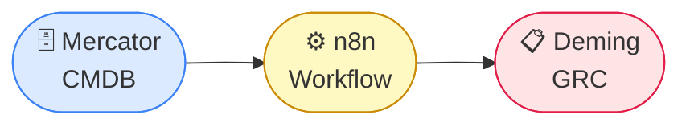
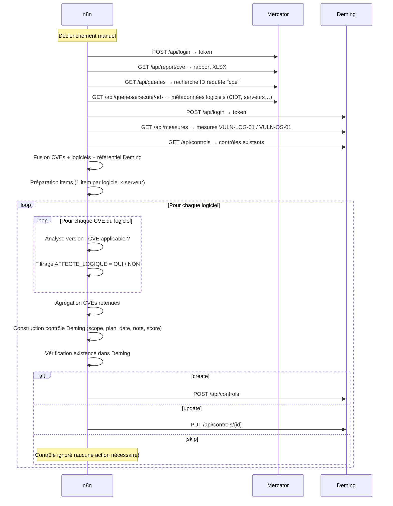
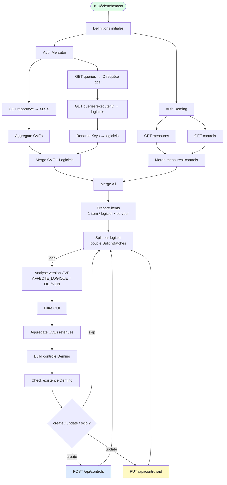
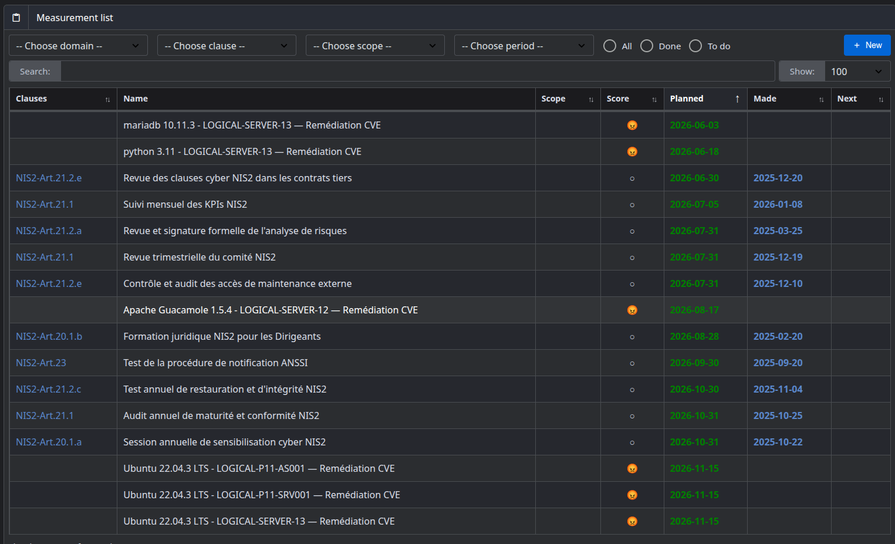
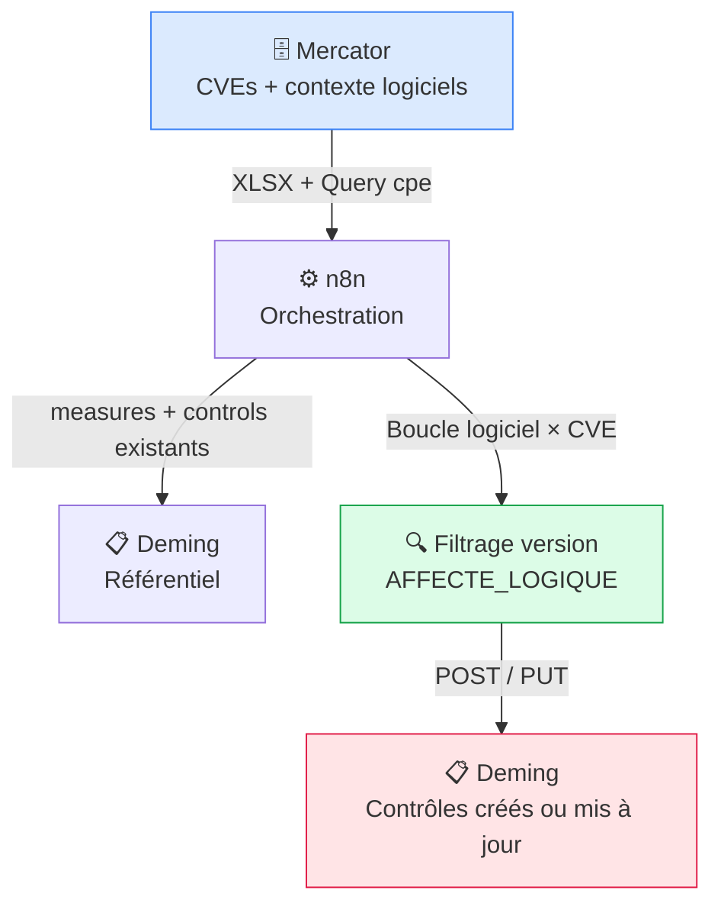

# Mercator → Deming : Automatisation de la gestion des CVEs

> Transformer une CMDB technique en moteur opérationnel de pilotage cyber — de la détection à la remédiation directe dans Deming.

## ⚠️ AVERTISSEMENT

Tous ces fichiers et ce process sont fournis à titre d'exemple de faisabilité, et doivent être adaptés à votre environnement et testés. Je ne peux pas garantir ni prendre d'engagement sur l'intégrité et le risque de perte de vos données.

---

## Vue d'ensemble

Ce projet automatise le cycle complet de gestion des vulnérabilités : depuis leur détection dans **Mercator** (CMDB), jusqu'à la création ou mise à jour de contrôles dans **Deming** (GRC), **directement via l'API**, orchestré par **n8n**.

**Plus de LLM, plus de fichier JSON intermédiaire : les contrôles sont poussés en temps réel dans Deming, logiciel par logiciel, CVE par CVE.**


```mermaid
flowchart LR
    M([🗄️ Mercator\nCMDB]) --> N([⚙️ n8n\nWorkflow])
    N --> D([📋 Deming\nGRC])

    style M fill:#dbeafe,stroke:#3b82f6
    style N fill:#fef9c3,stroke:#ca8a04
    style D fill:#ffe4e6,stroke:#e11d48
```

**Ce que ça apporte :**

- Traitement logiciel par logiciel, CVE par CVE : la boucle s'arrête sur les erreurs sans interrompre le reste
- Filtrage intelligent des CVEs : seules les CVEs qui concernent réellement la version installée sont traitées
- Gestion des scores corrigée : le calcul de priorité et la `plan_date` fonctionnent désormais correctement
- Création ou mise à jour des contrôles Deming selon leur statut existant (create / update / skip)
- Zéro LLM, zéro dépendance à Ollama

---

## Prérequis

| Composant | Rôle | Version |
| --- | --- | --- |
| [Mercator](https://github.com/dbarzin/mercator) | CMDB source des CVEs | latest |
| [Deming](https://github.com/dbarzin/deming) | GRC cible des contrôles | latest |
| [n8n](https://n8n.io) | Orchestration du workflow | 2.x+ |


> **Ollama n'est plus nécessaire dans cette version.**

---

## Architecture détaillée

### Flux de données


```mermaid
sequenceDiagram
    participant N as n8n
    participant M as Mercator
    participant D as Deming

    Note over N: Déclenchement manuel

    N->>M: POST /api/login → token
    N->>M: GET /api/report/cve → rapport XLSX
    N->>M: GET /api/queries → recherche ID requête "cpe"
    N->>M: GET /api/queries/execute/{id} → métadonnées logiciels (CIDT, serveurs…)

    N->>D: POST /api/login → token
    N->>D: GET /api/measures → mesures VULN-LOG-01 / VULN-OS-01
    N->>D: GET /api/controls → contrôles existants

    N->>N: Fusion CVEs + logiciels + référentiel Deming
    N->>N: Préparation items (1 item par logiciel × serveur)
    
    loop Pour chaque logiciel
        loop Pour chaque CVE du logiciel
            N->>N: Analyse version : CVE applicable ?
            N->>N: Filtrage AFFECTE_LOGIQUE = OUI / NON
        end
        N->>N: Agrégation CVEs retenues
        N->>N: Construction contrôle Deming (scope, plan_date, note, score)
        N->>N: Vérification existence dans Deming
        alt create
            N->>D: POST /api/controls
        else update
            N->>D: PUT /api/controls/{id}
        else skip
            Note over N: Contrôle ignoré (aucune action nécessaire)
        end
    end
```

---

## Détail du workflow n8n

### Variables de configuration (nœud `Definitions initiales`)

| Variable | Exemple | Description |
| --- | --- | --- |
| `company` | `mon-entreprise` | Nom utilisé dans les noms de fichiers |
| `directory` | `/home/user/mercator` | Répertoire de travail |
| `mercatorHost` | `172.17.0.1` | Adresse Mercator |
| `mercatorPort` | `8081` | Port Mercator |
| `demingHost` | `172.17.0.1` | Adresse Deming |
| `demingPort` | `8030` | Port Deming |


### Étapes du workflow


```mermaid
flowchart TD
    T([▶️ Déclenchement]) --> C[Definitions initiales]
    C --> MA[Auth Mercator]
    C --> DA[Auth Deming]

    MA --> CV[GET report/cve → XLSX]
    MA --> QR[GET queries → ID requête 'cpe']
    QR --> Q7[GET queries/execute/ID → logiciels]

    CV --> AGG[Aggregate CVEs]
    Q7 --> REN[Rename Keys → logiciels]

    AGG --> MRG1[Merge CVE + Logiciels]
    REN --> MRG1

    DA --> MEA[GET measures]
    DA --> CTR[GET controls]
    MEA --> MRG2[Merge measures+controls]
    CTR --> MRG2

    MRG1 --> MRG3[Merge All]
    MRG2 --> MRG3

    MRG3 --> PREP[Prépare items\n1 item / logiciel × serveur]
    PREP --> SPLIT[Split par logiciel\nboucle SplitInBatches]

    SPLIT -->|loop| CVE[Analyse version CVE\nAFFECTE_LOGIQUE = OUI/NON]
    CVE --> IF1[Filtre OUI]
    IF1 --> AGG2[Aggregate CVEs retenues]
    AGG2 --> BUILD[Build contrôle Deming]
    BUILD --> CHECK[Check existence Deming]
    CHECK --> IF2{create / update / skip ?}
    IF2 -->|create| POST[POST /api/controls]
    IF2 -->|update| PUT[PUT /api/controls/id]
    IF2 -->|skip| SPLIT
    POST --> SPLIT
    PUT --> SPLIT

    style T fill:#dcfce7
    style POST fill:#dbeafe
    style PUT fill:#fef9c3
```

---

## Filtrage intelligent des CVEs par version

C'est l'une des fonctionnalités clés de cette version. Pour chaque CVE, le workflow analyse automatiquement le résumé textuel (CVE Summary) et compare la version du logiciel installé avec les versions vulnérables mentionnées.

### Logique d'analyse

| Cas détecté dans le résumé | Décision | Exemple |
| --- | --- | --- |
| "before", "prior to", "older" + version | OUI si version installée ≤ version max affectée | `before 3.0.8` → v3.0.5 = OUI |
| "through", "to" + plage de versions | OUI si version dans l'intervalle | `2.0 through 2.4` → v2.2 = OUI |
| "upgrade to", "fixed in" + version correctif | OUI si version installée < version du correctif | `fixed in 1.5.3` → v1.5.1 = OUI |
| Aucune version détectée | INCONNU (traité comme OUI par prudence) | — |
| Logiciel = OS (`VULN-OS-01`) | OUI systématique (maintenance préventive) | Ubuntu 22.04 |

Seules les CVEs avec `AFFECTE_LOGIQUE = OUI` sont agrégées et transmises à Deming.

---

## Données extraites de Mercator

### Source 1 : Rapport CVE (`GET /api/report/cve`)

Retourne un fichier XLSX avec pour chaque application :

| Champ | Description |
| --- | --- |
| `Name` | Nom du logiciel |
| `CVE` | Identifiant de la vulnérabilité |
| `CVE Score` | Sévérité CVSS (0–10) |
| `CVE Summary` | Description textuelle (utilisée pour le filtrage version) |
| `CVE Impact` | Impact de la CVE |

> 📖 Documentation Mercator : https://dbarzin.github.io/mercator/fr/vulnerabilities/

### Source 2 : Métadonnées logiciels (requête Mercator nommée `"cpe"`)

Le workflow cherche dynamiquement l'ID de la requête nommée `cpe` dans Mercator (plus d'ID hardcodé). Elle retourne pour chaque logiciel :

| Champ | Description |
| --- | --- |
| `name` | Nom du logiciel |
| `version` | Version installée (utilisée pour le filtrage CVE) |
| `security_need_c/i/a/t` | Besoins CIDT (0–4) |
| `rto` / `rpo` | Objectifs de reprise |
| `logicalServers.name` | Serveur(s) hébergeant le logiciel |
| `logicalServers.operating_system` | Système d'exploitation |

### Correspondance CIDT

| Niveau | Valeur | Signification |
| --- | --- | --- |
| Null | Insignifiant | — |
| 3 | Faible | 🟢 |
| 2 | Moyen | 🟠 |
| 1 | Fort | 🔴 |


---

## Règles de priorisation et calcul de score

### Calcul de la priorité

La priorité est calculée à partir du score CVSS et du besoin de sécurité maximal (CIDT) :

| Condition | Priorité |
| --- | --- |
| CVSS ≥ 10.0 **ou** (need ≥ 3 et CVSS ≥ 7.0) | 🔴 Critical |
| CVSS > 7.0 **ou** need ≥ 3 | 🟠 High |
| CVSS > 4.0 | 🟢 Low |

### Délais de remédiation automatiques

| Priorité | Délai | Plan date |
| --- | --- | --- |
| 🔴 Critical | J+15 | Recalculée si plan_date existante < J+15 |
| 🟠 High | J+30 | Recalculée si plan_date existante < J+15 |
| 🟢 Low | J+90 | Recalculée si plan_date existante < J+15 |

### Dispatch des clauses Deming

| Clause | Condition |
| --- | --- |
| `VULN-OS-01` | Le nom du logiciel correspond au nom de l'OS du serveur |
| `VULN-LOG-01` | Tous les autres logiciels applicatifs |

---

## Gestion des contrôles existants dans Deming

Avant de créer ou mettre à jour un contrôle, le workflow vérifie son existence dans Deming en comparant le champ `scope` et le `measure_id`.

| Situation | Action | Comportement |
| --- | --- | --- |
| Contrôle inexistant | `create` | POST → nouveau contrôle |
| Contrôle existant, statut = 0 (ouvert) | `update` | PUT → mise à jour plan_date et note |
| Contrôle existant, statut = 1 (en cours) | `update` | PUT avec avertissement ⚠️ dans le champ note |
| Contrôle existant, statut = 2 (clôturé) | `create` | POST → recréation avec référence au précédent |

**Champs protégés lors d'un update** : `status`, `realisation_date`, `score` — ces champs ne sont jamais écrasés.

### Format du champ `scope`

```
<logiciel> <version> | <serveur_logique> | Remédiation CVE
```

Exemple : `mariadb 10.11.3 | LOGICAL-SERVER-13 | Ubuntu 22.04 LTS`

---

## Clauses Deming (limitation connue)

> ⚠️ **La liaison des contrôles aux clauses Deming est en attente de correction par le développeur.** Les contrôles sont créés et mis à jour correctement, mais l'association à la clause (`VULN-LOG-01` / `VULN-OS-01`) peut ne pas être effective dans toutes les configurations. Un correctif est prévu.

---

## Capture d'écran — Résultat dans Deming



*Exemple de liste de mesures générée : remédiation CVE par logiciel et serveur, avec plan_date calculée automatiquement.*

---

## Installation pas à pas

### 1. Mercator et Deming

Suivre les README respectifs :

- https://github.com/dbarzin/mercator
- https://github.com/dbarzin/deming

### 2. Requête Mercator "cpe"

Dans l'interface Mercator, créer (ou vérifier l'existence d'une requête nommée exactement **`cpe`** avec le corps suivant :

```
FROM applications
FIELDS name, description, product, vendor, version, users, attributes, processes.name, processes.description, processes.owner, processes.activities.name, processes.macro_process.name, security_need_c, security_need_i, security_need_a, security_need_t, rto, rpo, logicalServers.name, logicalServers.operating_system, logicalServers.install_date, logicalServers.update_date
WHERE (
    attributes LIKE "%logiciel%"
    OR attributes LIKE "%opensource%"
)
WITH logical_servers
OUTPUT list
LIMIT 10
```
Attention à gérer la limite en fonction de votre besoin.

> Le workflow recherche cette requête dynamiquement par son nom. Si elle n'existe pas ou est mal nommée, le workflow lève une erreur explicite.

### 3. Mesures Deming requises

S'assurer que les deux controls suivants existent dans Deming avec ces clauses exactes :

- `VULN-LOG-01` — Remédiation logiciels applicatifs
- `VULN-OS-01` — Remédiation systèmes d'exploitation


### 5. Workflow n8n

1. Importer `Phase_1_-_Analyse_mercator_cves_v10.json` dans n8n (V2xx)
2. Ouvrir le nœud **`Definitions initiales`** et adapter :
   - `company` → votre identifiant entreprise
   - `directory` → votre chemin de travail
   - Adresses et ports de Mercator, Deming, et API
3. Exécuter manuellement via le bouton **Execute workflow**

---

## Limites connues

| Limite | Mitigation / Statut |
| --- | --- |
| Association aux clauses Deming | En attente de correction par le développeur |
| Filtrage version "INCONNU" | Les CVEs sans version détectée sont traitées par prudence (comme OUI) |
| Qualité des CPEs Mercator | Enrichir la CMDB pour de meilleurs résultats de filtrage |
| Temps de traitement | Dépend du volume de CVEs et de logiciels — prévoir quelques secondes à quelques minutes |

---

## Sécurité

- Ne jamais hardcoder les mots de passe dans les scripts — utiliser des variables d'environnement ou un coffre-fort (Vault, etc.)
- Isoler Deming, Mercator et l'API sur un réseau interne
- Activer les logs API et l'audit Deming pour la traçabilité

---

## Évolutions possibles

- Score EPSS / CVSS v4
- Scanners externes (Nessus, OpenVAS, Qualys)
- Notifications Teams / Slack à la fin du traitement
- Dashboard KPI Deming
- Déclenchement planifié (webhook ou cron n8n)
- Historisation des imports

---

## Résumé du flux


```mermaid
flowchart TD
    A[🗄️ Mercator\nCVEs + contexte logiciels] -->|XLSX + Query cpe| B[⚙️ n8n\nOrchestration]
    B -->|measures + controls existants| C[📋 Deming\nRéférentiel]
    B -->|Boucle logiciel × CVE| D[🔍 Filtrage version\nAFFECTE_LOGIQUE]
    D -->|POST / PUT| E[📋 Deming\nContrôles créés ou mis à jour]

    style A fill:#dbeafe,stroke:#3b82f6
    style E fill:#ffe4e6,stroke:#e11d48
    style D fill:#dcfce7,stroke:#16a34a
```
